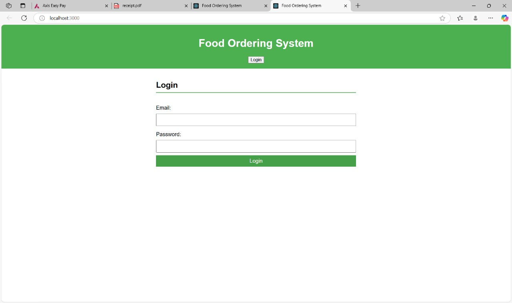
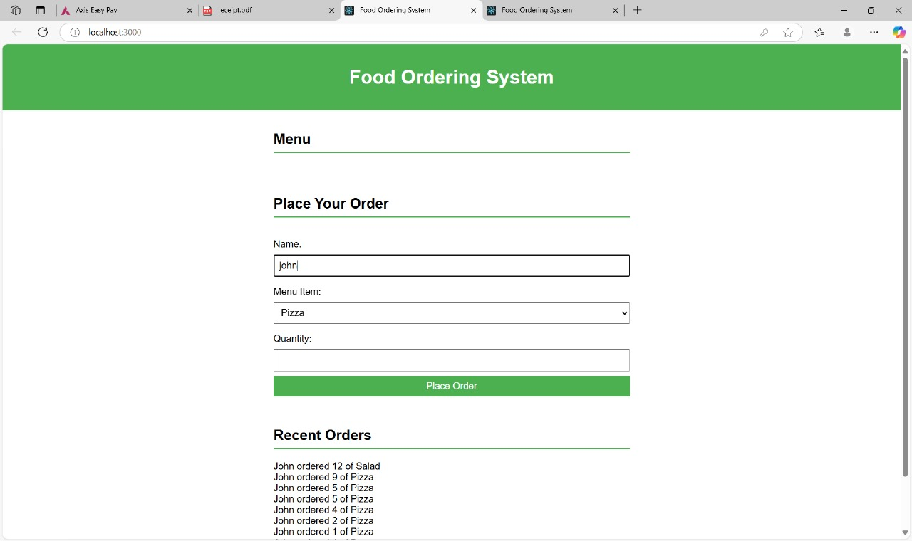

# Food Ordering System

A simple web application for managing a food ordering system, built with HTML, CSS, JavaScript, and a backend powered by Node.js. This project demonstrates a complete flow for user authentication, menu display, order placement, and order management.

## Features

- **User Authentication**:
  - Secure login system using email and password.
  - Session-based login management with logout functionality.

- **Dynamic Menu**:
  - Fetches menu items dynamically from the backend.
  - Populates a dropdown menu for item selection during order placement.

- **Order Placement**:
  - Allows users to place an order by selecting a menu item and specifying the quantity.
  - Sends order details to the backend for processing and storage.

- **Order Management**:
  - Displays a list of recent orders dynamically fetched from the backend.
  - Updates the orders list after new orders are placed.

- **Responsive Design**:
  - Clean and user-friendly interface that adapts to different screen sizes.


### Login Page


### Main Page (Menu, Place Order, Recent Orders)


---

## Installation

1. Clone the repository:
   ```bash
   git clone https://github.com/your-username/food-ordering-system.git
   cd food-ordering-system
